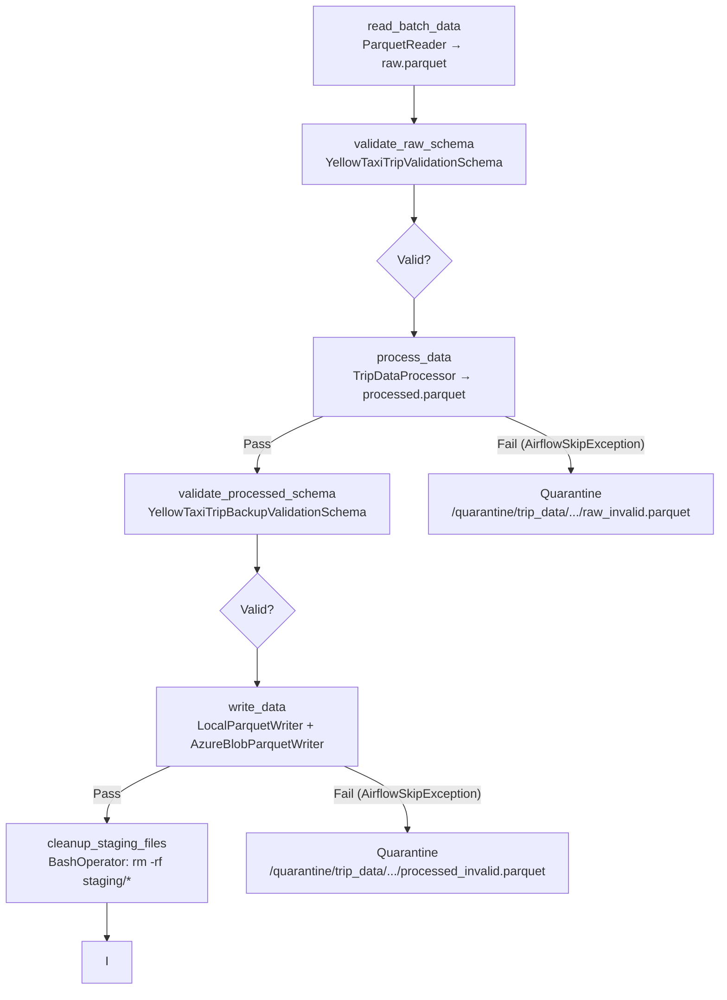
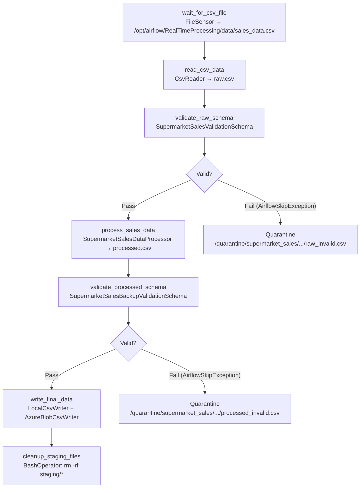

# Data Engineering Pipeline

A modular, Python-based ETL framework for both **batch** and **near real-time** data processing workloads, orchestrated by **Apache Airflow** and backed by **Azure Blob Storage** provisioned via **Terraform**.

---

## Table of Contents

## Table of Contents

1. [Environment & Infrastructure Setup](#1-environment--infrastructure-setup)
   - [Prerequisites](#11-prerequisites)
   - [Azure Authentication](#12-azure-authentication)
   - [Configuration](#13-configuration)
   - [Infrastructure Deployment (Terraform)](#14-infrastructure-deployment-terraform)
   - [Application Environment](#15-application-environment)
   - [Airflow Integration](#16-airflow-integration)
2. [Execution & Testing](#2-execution--testing)
   - [Running Unit Tests](#21-running-unit-tests)
   - [Running Pipelines](#22-running-pipelines)
3. [Architecture & Documentation](#3-architecture--documentation)
   - [Pipeline Architecture](#31-pipeline-architecture)
   - [Design Patterns & Principles](#32-design-patterns--principles)
   - [Interface Hierarchy](#33-interface-hierarchy)
4. [Contributors](#4-contributors)

---

## 1. Environment & Infrastructure Setup

### 1.1 Prerequisites

Ensure the following tools are installed and available on your `PATH` before proceeding:

| Tool | Version | Purpose |
|---|---|---|
| [Python](https://www.python.org/downloads/) | 3.10+ | Runtime for pipeline modules and tests |
| [pip](https://pip.pypa.io/) | Latest | Python package manager |
| [Azure CLI](https://learn.microsoft.com/en-us/cli/azure/install-azure-cli) | Latest | Azure authentication and resource management |
| [Terraform](https://developer.hashicorp.com/terraform/install) | >= 1.3 | Cloud infrastructure provisioning |
| [Docker Desktop](https://www.docker.com/products/docker-desktop/) | Latest | Container runtime for Airflow stack |

> **Windows users:** PowerShell is required for the virtual environment activation commands below.

---

### 1.2 Azure Authentication

Log in to your Azure account using the CLI:

```bash
az login
```

After a successful login, the CLI will print a list of your subscriptions. **Copy your Subscription ID** — it is required for the Terraform configuration in the next step.

```json
{
  "id": "xxxxxxxx-xxxx-xxxx-xxxx-xxxxxxxxxxxx",  // <-- Copy this value
  "name": "Your Subscription Name",
  ...
}
```

---

### 1.3 Configuration

The Airflow Docker Compose stack is configured via an `.env` file located inside the `airflow/` directory. Create it by copying the template:

```bash
# From the project root
cp airflow/.env_template airflow/.env
```

> **Note:** If `.env_template` is not present in the repository, create `airflow/.env` manually.

Open `airflow/.env` and fill in the required values:

```dotenv
# --- Airflow User ---
# Credentials for the Airflow web UI administrator account
_AIRFLOW_WWW_USER_USERNAME=airflow
_AIRFLOW_WWW_USER_PASSWORD=airflow

# --- Airflow Security ---
# A secret key used to sign JWT tokens for the Airflow API
AIRFLOW__API_AUTH__JWT_SECRET=your_strong_random_secret_here
AIRFLOW__API_AUTH__JWT_ISSUER=airflow

# --- Linux Only ---
# Set this to your host user ID to avoid permission issues with mounted volumes.
# Run: echo $(id -u) to find your UID.
AIRFLOW_UID=50000
```

---

### 1.4 Infrastructure Deployment (Terraform)

All cloud resources (Azure Resource Group, Storage Account, Blob Container) are defined in the `terraform/` directory.

**Step 1 — Navigate to the Terraform directory:**

```bash
cd terraform
```

**Step 2 — Configure Terraform Variables:**
The sensitive Terraform variables are configured via a `terraform.tfvars` file located inside the `terraform/` directory. Create it by copying the template:

```bash
# From the project root
cp ./.terraform.tfvars_template ./terraform.tfvars

Set your azure subscription id:
```bash
subscription_id = "Your-Azure-Subscription_id"
```

**Step 3 — Initialize the Terraform working directory:**

```bash
terraform init
```

**Step 4 — Preview the infrastructure plan & Apply the infrastructure:**

```bash
terraform apply
```

Type `yes` when prompted to confirm. Terraform will provision:
- An Azure Resource Group (`datapipelines-fp`)
- An Azure Storage Account (`pipelinedatastorage<random_suffix>`)
- An Azure Blob Container (`blob-data-container`)

**Step 5 — Retrieve the outputs required for Airflow:**

After `apply` completes, retrieve the Blob Storage Connection String:

```bash
terraform output -raw storage_connection_string
```

> This output is marked **sensitive**. Copy the printed value immediately — it will be needed in the Airflow UI configuration.

The Blob Container Name uses the default value defined in `variables.tf`:

```
blob-data-container
```

**Step 6 — Teardown Infrastructure (Clean Up):**
Once you are finished running the application and want to avoid incurring further Azure costs, you must tear down the provisioned resources. From the `terraform/` directory, run:

```bash
terraform destroy
```

Type `yes` when prompted to confirm.

---

### 1.5 Application Environment

A Python virtual environment is required to run the tests and pipeline modules locally.

**Create the virtual environment** (from the project root):

```bash
python -m venv .venv
```

**Activate the virtual environment:**

- **Windows (PowerShell):**
  ```powershell
  .\.venv\Scripts\Activate.ps1
  ```
  > If blocked by execution policy, run first:
  > ```powershell
  > Set-ExecutionPolicy -Scope Process -ExecutionPolicy Bypass
  > ```

- **macOS / Linux:**
  ```bash
  source .venv/bin/activate
  ```

**Install dependencies:**

```bash
python -m pip install --upgrade pip
pip install -r requirements.txt
```

**Deactivate when done:**

```bash
deactivate
```

---

### 1.6 Airflow Integration

#### Start the Airflow Stack

Navigate to the `airflow/` directory and start all services in detached mode:

```bash
cd airflow
docker compose up -d
```

This starts the following services: `postgres`, `redis`, `airflow-apiserver`, `airflow-scheduler`, `airflow-dag-processor`, `airflow-worker`, and `airflow-triggerer`.

#### Access the Web UI

Once all containers are healthy, open your browser and navigate to:

```
http://localhost:8081
```

Log in with the credentials defined in your `.env` file (default: `airflow` / `airflow`).

#### Configure the Azure Blob Storage Connection

In the Airflow Web UI, navigate to **Admin → Connections** and create a new connection with the following values:

| Field | Value |
|---|---|
| **Connection Id** | `azure_blob_default` |
| **Connection Type** | `Generic` |
| **Password** | `<paste the terraform output storage_connection_string value here>` |
| **Extra (JSON)** | `{"connection_string": "<paste the same connection string here>"}` |

> Both the `Password` field and the `Extra` JSON key are populated because the two DAGs retrieve the connection string via different methods. Populating both ensures full compatibility.

#### Configure the Azure Blob Container Variable

In the Airflow Web UI, navigate to **Admin → Variables** and create a new variable:

| Key | Value |
|---|---|
| `azure_blob_container_name` | `blob-data-container` |

---

## 2. Execution & Testing

### 2.1 Running Unit Tests

The project uses **`pytest`** as its test runner. All tests are located within the `test/` subdirectory of each module.

**Run the full test suite** (from the project root):

```bash
python -m pytest
```

**Run tests for a specific module:**

```bash
# Batch Processing tests
python -m pytest BatchProcessing/test

# Real-Time Processing tests
python -m pytest RealTimeProcessing/test

# Shared library tests
python -m pytest shared/test
```

---

### 2.2 Running Pipelines

The two Airflow DAGs can be executed in two ways:

#### Option A — Wait for the Scheduled Interval

Both DAGs are configured within a specific schedule. Once the Airflow scheduler is running, the DAGs will trigger automatically at midnight UTC each day.

- `trip_data_processing_pipeline` — processes NYC Yellow Taxi Parquet data daily.
- `supermarket_sales_processing_pipeline` — processes Supermarket Sales CSV data daily.

#### Option B — Manual Trigger via the Web UI

1. Open the Airflow Web UI at `http://localhost:8081`.
2. Locate the desired DAG in the **DAGs** list (ensure it is **unpaused** using the toggle switch).
3. Click the **Trigger DAG** button (▶ play icon) on the right side of the DAG row.
4. Optionally provide a JSON configuration and click **Trigger**.

The DAG run will appear immediately in the **Grid** or **Graph** view, where you can monitor each task's status in real time.

---

## 3. Architecture & Documentation

### 3.1 Pipeline Architecture

#### Batch Processing Pipeline (`trip_data_processing_pipeline`)

Processes NYC Yellow Taxi trip records in Parquet format through a stage-gate validation pattern.



#### Real-Time Processing Pipeline (`supermarket_sales_processing_pipeline`)

Monitors a landing zone for incoming CSV files and processes Supermarket Sales data.



---

### 3.2 Design Patterns & Principles

The codebase is structured around **SOLID principles** and **Clean Code** practices:

#### Single Responsibility Principle (SRP)
Each class has exactly one reason to change. `DataReader` reads, `DataProcessor` transforms, `DataWriter` persists, and `DataValidator` validates. No class conflates these concerns.

#### Open/Closed Principle (OCP)
The system is open for extension but closed for modification. Adding a new pipeline domain (e.g., `StreamingProcessing`) requires only implementing `PipelineProcessor` — no existing DAG or shared code needs to change.

#### Liskov Substitution Principle (LSP)
All concrete implementations (`BatchPipelineProcessor`, `RealTimePipelineProcessor`) are fully substitutable for their abstract base `PipelineProcessor`. The DAG execution helpers in `pipeline_dag_executions.py` operate exclusively on the `PipelineProcessor` type.

#### Interface Segregation Principle (ISP)
Clients are not forced to depend on interfaces they do not use. The four low-level contracts (`DataReader`, `DataProcessor`, `DataWriter`, `DataValidator`) are kept separate and narrow, each exposing a single abstract method.

#### Dependency Inversion Principle (DIP)
High-level orchestration (DAG tasks) depends on the `PipelineProcessor` abstraction, not on concrete implementations. Writers are injected into `run_writer()` as a `List[DataWriter]`, enabling the **Composite Pattern** via `CompositeWriter` to fan out writes to multiple destinations (local + Azure) without the processor knowing about either.

#### Quarantine Pattern
The `execute_validator` wrapper in `pipeline_dag_executions.py` implements a **dead-letter / quarantine** pattern: on schema violation, the offending file is atomically moved to a quarantine path and an `AirflowSkipException` is raised, preventing downstream tasks from processing corrupt data while keeping the pipeline run visible and auditable.

---

### 3.3 Interface Hierarchy

```mermaid
classDiagram
    class PipelineProcessor {
        <<abstract>>
        +run_reader(source_path, output_path, correlation_id) str
        +run_validator(input_path, correlation_id) str
        +run_processor(input_path, output_path, correlation_id) str
        +run_writer(source_path, final_destination, correlation_id, writers) None
        +create_output_dir(output_path) None
    }

    class BatchPipelineProcessor {
        +run_reader(source_path, output_path, correlation_id) str
        +run_validator(input_path, correlation_id) str
        +run_processor(input_path, output_path, correlation_id) str
    }

    class RealTimePipelineProcessor {
        +run_reader(source_path, output_path, correlation_id) str
        +run_validator(input_path, correlation_id) str
        +run_processor(input_path, output_path, correlation_id) str
    }

    class DataReader {
        <<abstract>>
        +read(source) DataFrame
    }

    class ParquetReader {
        +read(source) DataFrame
    }

    class CsvReader {
        +read(source) DataFrame
    }

    class DataProcessor {
        <<abstract>>
        +process(df) DataFrame
    }

    class TripDataProcessor {
        +process(df) DataFrame
    }

    class SupermarketSalesDataProcessor {
        +process(df) DataFrame
    }

    class DataWriter {
        <<abstract>>
        +write(df, destination) None
    }

    class LocalParquetWriter {
        +write(df, destination) None
    }

    class AzureBlobParquetWriter {
        +write(df, destination) None
    }

    class LocalCsvWriter {
        +write(df, destination) None
    }

    class AzureBlobCsvWriter {
        +write(df, destination) None
    }

    class CompositeWriter {
        -writers List~DataWriter~
        +write(source_path, destination) None
    }

    class DataValidator {
        <<abstract>>
        +validate(df, dataset_schema) None
    }

    class GenericDataValidator {
        +validate(df, dataset_schema) None
    }

    class DataFrameSchema {
        <<abstract>>
        +get_schema() pa.DataFrameSchema
    }

    class YellowTaxiTripValidationSchema {
        +get_schema() pa.DataFrameSchema
    }

    class YellowTaxiTripBackupValidationSchema {
        +get_schema() pa.DataFrameSchema
    }

    class SupermarketSalesValidationSchema {
        +get_schema() pa.DataFrameSchema
    }

    class SupermarketSalesBackupValidationSchema {
        +get_schema() pa.DataFrameSchema
    }

    PipelineProcessor <|-- BatchPipelineProcessor
    PipelineProcessor <|-- RealTimePipelineProcessor

    DataReader <|-- ParquetReader
    DataReader <|-- CsvReader

    DataProcessor <|-- TripDataProcessor
    DataProcessor <|-- SupermarketSalesDataProcessor

    DataWriter <|-- LocalParquetWriter
    DataWriter <|-- AzureBlobParquetWriter
    DataWriter <|-- LocalCsvWriter
    DataWriter <|-- AzureBlobCsvWriter
    DataWriter <|-- CompositeWriter

    DataValidator <|-- GenericDataValidator

    DataFrameSchema <|-- YellowTaxiTripValidationSchema
    DataFrameSchema <|-- YellowTaxiTripBackupValidationSchema
    DataFrameSchema <|-- SupermarketSalesValidationSchema
    DataFrameSchema <|-- SupermarketSalesBackupValidationSchema
```



---

## 4. Contributors

| Contributor | GitHub Profile |
|---|---|
| **Juangmz7** | [@Juangmz7](https://github.com/Juangmz7) |
| **nilis24** | [@nilis24](https://github.com/nilis24) |
```

---

**Key source references used to generate this document:**

- DAG task chains and schedules: [1](#0-0) [2](#0-1) 
- Quarantine logic: [3](#0-2) 
- Abstract contracts: [4](#0-3) 
- Terraform variables and defaults: [5](#0-4) 
- Terraform output: [6](#0-5) 
- Docker Compose port mapping and volumes: [7](#0-6) [8](#0-7) 
- Azure connection retrieval in DAGs: [9](#0-8) [10](#0-9) 
- Blob storage resources: [11](#0-10) 
- Contributors identified from commit history.

### Citations

**File:** airflow/dags/batch_pipeline_dag.py (L29-34)
```python
    azure_connection = BaseHook.get_connection('azure_blob_default')

    extras = azure_connection.extra_dejson
    azure_conn_str = extras.get('connection_string') 

    azure_container = Variable.get("azure_blob_container_name", default_var="trip-data-processed")
```

**File:** airflow/dags/batch_pipeline_dag.py (L62-144)
```python
with DAG(
    dag_id='trip_data_processing_pipeline',
    default_args=default_args,
    description='Daily orchestration of the Trip Data batch pipeline with DI and Quarantine',
    schedule='@daily',
    start_date=datetime(2026, 4, 1),
    catchup=False,
    tags=['trip_data', 'batch', 'etl'],
) as dag:

    LANDING_ZONE_FILE = '/opt/airflow/BatchProcessing/data/yellow_tripdata_2025-01.parquet'
    BASE_STAGING_PATH = "/opt/airflow/data/staging/trip_data/{{ ds }}"
    FINAL_DESTINATION = "/opt/airflow/data/processed/{{ ds }}/trip_data.parquet" 
    
    QUARANTINE_PATH_RAW = "/opt/airflow/quarantine/trip_data/{{ ds }}/{{ run_id }}_raw_invalid.parquet"
    QUARANTINE_PATH_PROCESSED = "/opt/airflow/quarantine/trip_data/{{ ds }}/{{ run_id }}_processed_invalid.parquet"
    
    DAG_CORRELATION_ID = "{{ run_id }}"

    task_reader = PythonOperator(
        task_id='read_batch_data',
        python_callable=execute_reader,
        op_kwargs={
            'processor_class': BatchPipelineProcessor,
            'correlation_id': DAG_CORRELATION_ID,
            'output_path': f"{BASE_STAGING_PATH}/raw.parquet",
            'source_path': LANDING_ZONE_FILE,
        },
    )

    task_validator = PythonOperator(
        task_id='validate_raw_schema',
        python_callable=execute_validator,
        op_kwargs={
            'processor_class': BatchPipelineProcessor,
            'schema_class': YellowTaxiTripValidationSchema,
            'input_path': f"{BASE_STAGING_PATH}/raw.parquet",
            'quarantine_path': QUARANTINE_PATH_RAW,
            'correlation_id': DAG_CORRELATION_ID,
        },
    )

    task_processor = PythonOperator(
        task_id='process_data',
        python_callable=execute_processor,
        op_kwargs={
            'processor_class': BatchPipelineProcessor,
            'input_path': f"{BASE_STAGING_PATH}/raw.parquet",
            'output_path': f"{BASE_STAGING_PATH}/processed.parquet",
            'correlation_id': DAG_CORRELATION_ID,
        },
    )

    task_validator_backup = PythonOperator(
        task_id='validate_processed_schema',
        python_callable=execute_validator,
        op_kwargs={
            'processor_class': BatchPipelineProcessor,
            'schema_class': YellowTaxiTripBackupValidationSchema,
            'input_path': f"{BASE_STAGING_PATH}/processed.parquet",
            'quarantine_path': QUARANTINE_PATH_PROCESSED,
            'correlation_id': DAG_CORRELATION_ID,
        },
    )

    task_writer = PythonOperator(
        task_id='write_data',
        python_callable=_execute_writer,
        op_kwargs={
            'processor_class': BatchPipelineProcessor,
            'source_path': f"{BASE_STAGING_PATH}/processed.parquet",
            'final_destination': FINAL_DESTINATION,
            'correlation_id': DAG_CORRELATION_ID,
        },
    )

    cleanup_staging = BashOperator(
        task_id='cleanup_staging_files',
        bash_command=f'rm -rf {BASE_STAGING_PATH}/*',
        trigger_rule='all_success' 
    )

    task_reader >> task_validator >> task_processor >> task_validator_backup >> task_writer >> cleanup_staging
```

**File:** airflow/dags/real_time_pipeline_dag.py (L33-35)
```python
    azure_connection = BaseHook.get_connection('azure_blob_default')
    azure_conn_str = azure_connection.password
    azure_container = Variable.get("azure_blob_container_name", default_var="blob-data-container")
```

**File:** airflow/dags/real_time_pipeline_dag.py (L64-159)
```python
with DAG(
    dag_id='supermarket_sales_processing_pipeline',
    default_args=default_args,
    description='Near real-time processing of Supermarket Sales with Quarantine routing',
    # schedule='* * * * *',  
    schedule='@daily',  
    start_date=datetime(2026, 4, 1),
    catchup=False,
    max_active_runs=1,
    tags=['sales', 'near_real_time', 'etl'],
) as dag:

    # El file en nuestro windows iria en RealTimeProcessing/data/sales_data.csv, pero en Airflow lo vamos a montar aqui
    LANDING_ZONE_FILE = "/opt/airflow/RealTimeProcessing/data/sales_data.csv"
    
    BASE_STAGING_PATH = "/opt/airflow/data/staging/supermarket_sales/{{ ds }}"
    FINAL_DESTINATION_PATH = "processed/{{ ds }}/supermarket_sales.csv"
    
    QUARANTINE_PATH_RAW = "/opt/airflow/quarantine/supermarket_sales/{{ ds }}/{{ run_id }}_raw_invalid.csv"
    QUARANTINE_PATH_PROCESSED = "/opt/airflow/quarantine/supermarket_sales/{{ ds }}/{{ run_id }}_processed_invalid.csv"
    
    DAG_CORRELATION_ID = "{{ run_id }}"

    sensor_incoming_file = FileSensor(
        task_id='wait_for_csv_file',
        filepath=LANDING_ZONE_FILE,
        fs_conn_id='fs_default',
        poke_interval=10,
        timeout=60,
        mode='poke',
    )

    task_reader = PythonOperator(
        task_id='read_csv_data',
        python_callable=execute_reader,
        op_kwargs={
            'processor_class': RealTimePipelineProcessor,
            'source_path': LANDING_ZONE_FILE,
            'output_path': f"{BASE_STAGING_PATH}/raw.csv",
            'correlation_id': DAG_CORRELATION_ID,
        },
    )

    task_validator = PythonOperator(
        task_id='validate_raw_schema',
        python_callable=execute_validator,
        op_kwargs={
            'processor_class': RealTimePipelineProcessor,
            'schema_class': SupermarketSalesValidationSchema,
            'input_path': f"{BASE_STAGING_PATH}/raw.csv",
            'quarantine_path': QUARANTINE_PATH_RAW,
            'correlation_id': DAG_CORRELATION_ID,
        },
    )

    task_processor = PythonOperator(
        task_id='process_sales_data',
        python_callable=execute_processor,
        op_kwargs={
            'processor_class': RealTimePipelineProcessor,
            'input_path': f"{BASE_STAGING_PATH}/raw.csv",
            'output_path': f"{BASE_STAGING_PATH}/processed.csv",
            'correlation_id': DAG_CORRELATION_ID,
        },
    )

    task_validator_backup = PythonOperator(
        task_id='validate_processed_schema',
        python_callable=execute_validator,
        op_kwargs={
            'processor_class': RealTimePipelineProcessor,
            'schema_class': SupermarketSalesBackupValidationSchema,
            'input_path': f"{BASE_STAGING_PATH}/processed.csv",
            'quarantine_path': QUARANTINE_PATH_PROCESSED,
            'correlation_id': DAG_CORRELATION_ID,
        },
    )

    task_writer = PythonOperator(
        task_id='write_final_data',
        python_callable=_execute_writer,
        op_kwargs={
            'processor_class': RealTimePipelineProcessor,
            'source_path': f"{BASE_STAGING_PATH}/processed.csv",
            'final_destination': FINAL_DESTINATION_PATH,
            'correlation_id': DAG_CORRELATION_ID,
        },
    )

    cleanup_staging = BashOperator(
        task_id='cleanup_staging_files',
        bash_command=f'rm -rf {BASE_STAGING_PATH}/*',
        trigger_rule='all_success' 
    )

    sensor_incoming_file >> task_reader >> task_validator >> task_processor >> task_validator_backup >> task_writer >> cleanup_staging
```

**File:** shared/implementations/pipeline_dag_executions.py (L21-43)
```python
def execute_validator(
    processor_class: Type[PipelineProcessor], 
    schema_class: Type[DataFrameSchema],
    input_path: str, 
    quarantine_path: str, 
    correlation_id: str
) -> str:
    processor: PipelineProcessor = processor_class()
    
    try:
        return processor.run_validator(input_path, schema_class, correlation_id)
    except ValueError as e:
        target_dir = os.path.dirname(quarantine_path)
        os.makedirs(target_dir, exist_ok=True)
        
        if not os.path.exists(input_path):
            raise FileNotFoundError(f"Input path not found: {input_path}")
            
        shutil.move(input_path, quarantine_path)
        
        raise AirflowSkipException(
            f"Validation contract broken. Data safely routed to quarantine: {quarantine_path}"
        ) from e
```

**File:** shared/contracts/pipeline_processor.py (L9-44)
```python
class PipelineProcessor(ABC):
    
    @abstractmethod
    def run_reader(self,
                   source_path: str,
                   output_path: str,
                   correlation_id: str
                ) -> str:
        pass

    @abstractmethod
    def run_validator(self, input_path: str, correlation_id: str) -> str:
        pass

    @abstractmethod
    def run_processor(self, input_path: str, output_path: str, correlation_id: str) -> str:
        pass

    def create_output_dir(self, output_path: str) -> None:
        if not os.path.exists(output_path): 
            output_path_dir = Path(output_path).parent
            output_path_dir.mkdir(parents=True, exist_ok=True)

    def run_writer(self, 
                   source_path: str, 
                   final_destination: str, 
                   correlation_id: str,
                   writers: List[DataWriter]) -> None:
        
        composite_writer = CompositeWriter(
            writers=writers, 
            correlation_id=correlation_id
        )
        
        # execution of the composite pattern
        composite_writer.write(source_path=source_path, destination=final_destination)
```

**File:** terraform/variables.tf (L28-34)
```terraform
variable "blob_container_name" {
    type        = string
    default     = "blob-data-container"
    description = "Name of the blob container"
    sensitive   = false
}
```

**File:** terraform/output.tf (L1-5)
```terraform
output "storage_connection_string" {
  value       = azurerm_storage_account.storage_account.primary_connection_string
  sensitive   = true
  description = "Connection string to use in the Python script"
}
```

**File:** airflow/docker-compose.yaml (L80-88)
```yaml
  volumes:
    - ${AIRFLOW_PROJ_DIR:-.}/dags:/opt/airflow/dags
    - ${AIRFLOW_PROJ_DIR:-.}/logs:/opt/airflow/logs
    - ${AIRFLOW_PROJ_DIR:-.}/config:/opt/airflow/config
    - ${AIRFLOW_PROJ_DIR:-.}/plugins:/opt/airflow/plugins
    - ../BatchProcessing:/opt/airflow/BatchProcessing
    - ../RealTimeProcessing:/opt/airflow/RealTimeProcessing
    - ../shared:/opt/airflow/shared
  user: "${AIRFLOW_UID:-50000}:0"
```

**File:** airflow/docker-compose.yaml (L126-137)
```yaml
  airflow-apiserver:
    <<: *airflow-common
    command: api-server
    ports:
      - "8081:8080"
    healthcheck:
      test: ["CMD", "curl", "--fail", "http://localhost:8080/api/v2/monitor/health"]
      interval: 30s
      timeout: 10s
      retries: 5
      start_period: 30s
    restart: always
```

**File:** terraform/blob_storage.tf (L1-20)
```terraform
resource "azurerm_storage_account" "storage_account" {
  name                     = "${var.storage_account_name}${random_integer.ri.result}"
  resource_group_name      = azurerm_resource_group.main.name
  location                 = azurerm_resource_group.main.location
  account_tier             = "Standard"
  account_replication_type = "LRS"

  # Set to 'Cool' since the use case involves writing a lot of data and reading infrequently.
  access_tier              = "Cool"

  tags = {
    environment = "data-pipeline"
    purpose     = "data-processed-storage"
  }
}

resource "azurerm_storage_container" "blob_container" {
  name                  = var.blob_container_name
  storage_account_id    = azurerm_storage_account.storage_account.id
  container_access_type = "private"
```
